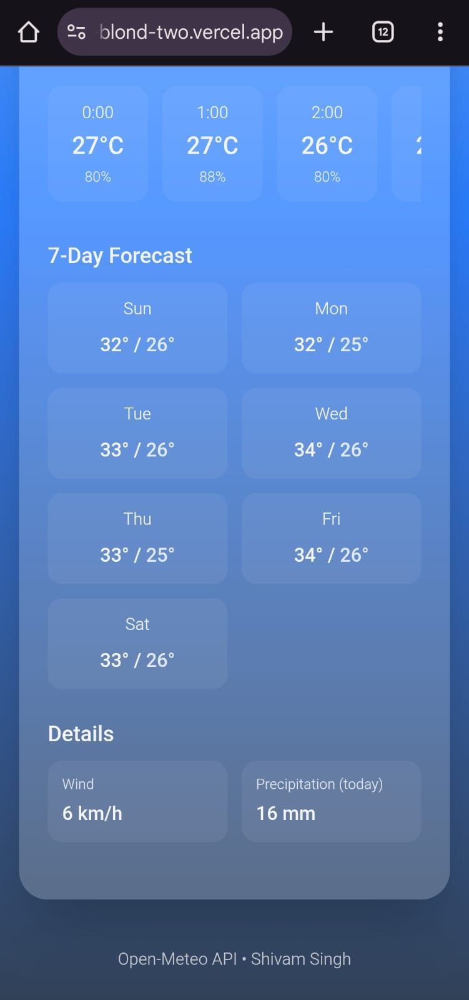

# Weather Now ☁️

A modern, mobile-friendly weather app inspired by Google Weather. Provides real-time weather updates, hourly forecasts, and a 7-day outlook with a beautiful UI.

[Live Demo](https://weather-now-blond-two.vercel.app/)

## Screenshots

## Screenshots

<div align="center">
  
  <br/>
  
  <br/>
  
  <br/>
  
</div>

*(See screenshots above for a preview of the desktop and mobile UI.)*

---

## Features

- **Google-like UI:** Clean and intuitive interface, closely inspired by Google Weather.
- **Mobile Friendly:** Fully responsive design, works beautifully on all devices.
- **Real-Time Weather:** Get current temperature, weather condition, wind speed, and precipitation.
- **Hourly Forecast:** View weather updates by the hour, including temperature and precipitation probability.
- **7-Day Forecast:** Detailed daily temperature highs/lows for a week.
- **Wind & Precipitation Details:** Extra weather details for enthusiasts.
- **Open-Meteo API Integration:** Reliable data powered by [Open-Meteo API](https://open-meteo.com/).
- **Modern Stack:** Built using React, Tailwind CSS, and [shadcn/ui](https://ui.shadcn.com/).
- **Easy Search:** Enter any city name for instant weather info.
- **Sleek UI Design:** Soft gradients, glassmorphism, and accessible color schemes.

---

## Getting Started

### Installation

```bash
npm install
```

### Development

```bash
npm run dev
```

Open [http://localhost:5173](http://localhost:5173) to view it in your browser.

---

## Tech Stack

- **Frontend:** React, Tailwind CSS, shadcn/ui
- **API:** [Open-Meteo API](https://open-meteo.com/)
- **Deployment:** [Vercel](https://vercel.com/)

---

## Author

**Shivam Singh**  
Email: [ss132k4@gmail.com](mailto:ss132k4@gmail.com)  
GitHub: [SiNGH132k4](https://github.com/SiNGH132k4)

---

## Notes

- This project is not affiliated with Google.
- Data may vary based on API availability and city input.

---

<div align="center">
  <sub>Made with ❤️ by Shivam Singh | Powered by Open-Meteo API</sub>
</div>
